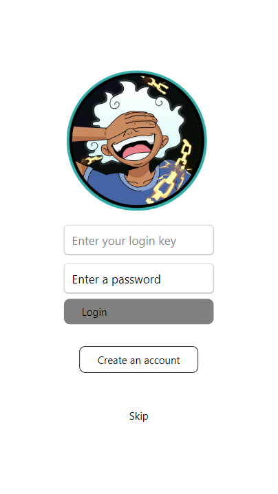
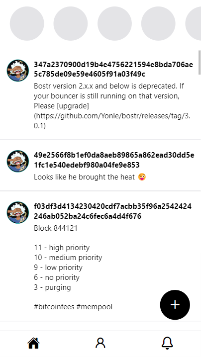

## Mobile

Joyboy Mobile folder in React-native with Expo.

### Test

To test the project, run:

```bash
cd JoyboyCommunity
npm i
npm start
```

Select Expo web, Android or IOS. You can scan it with Expo GO on your phone.

### Screens of the mobile app
Recent implementation PoC on React Native.
Here is what we have on the mobile app on the first days, contributions welcome! 
Check the issues with the "mobile" labels.

Done:
- Create or import Nostr account
- Feed for notes
- See user page with notes 
- Create note on Nostr 

WIP:
- Read Nostr tags content
- View user page details: followers and follows, replies, likes, repost with all details of the users.
- Note interactions: Replies, Likes, Report, Tips
- My profile: Update my profile
- Feed: Search, Trending fees, For you, Discover
- DM with private message: NIP-17
- Public chat: NIP-28
 
[UI/UX proposal for video discussions](https://github.com/keep-starknet-strange/joyboy/discussions/48#discussion-6683225)

Work present: 

Home page: 
  

[UI video discussions](https://t.me/JoyboyStarknet/206/397)

Create Nostr account
  

Feed by default
  

User feed with notes


Pick a good first issue with the mobile labels, and let's contribute and keep building cool things in Open-source.