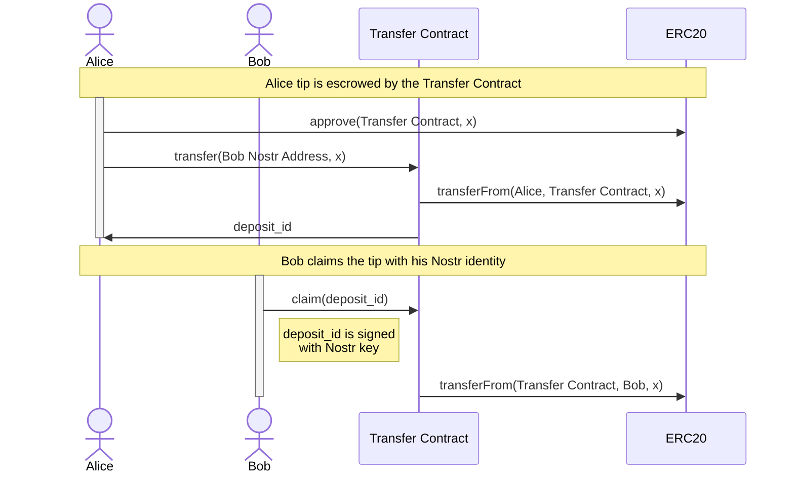
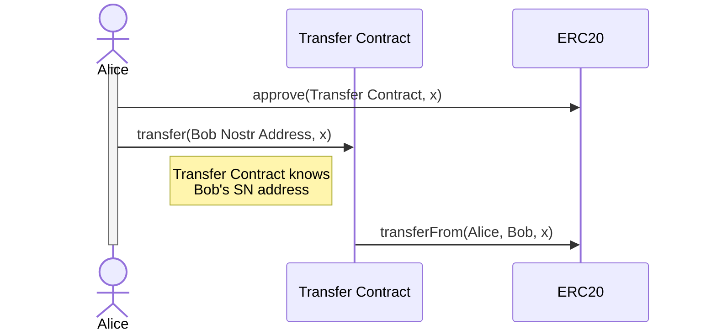
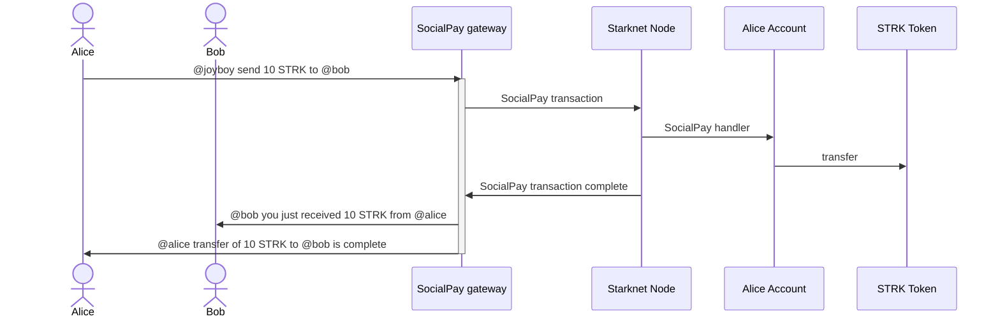
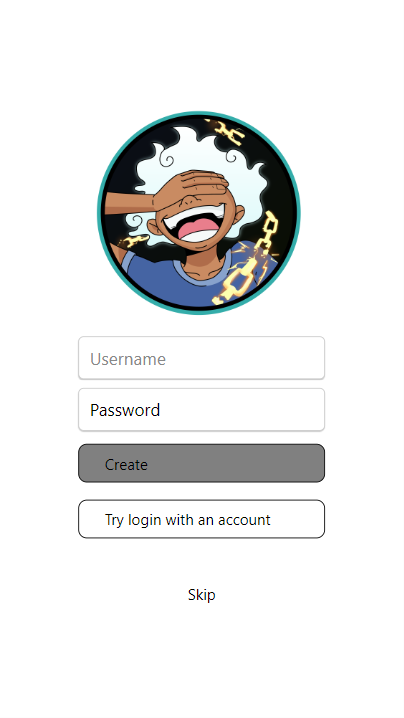

<div align="center">
  

[](https://github.com/keep-starknet-strange/joyboy/actions/workflows/starknet-contracts.yml)

[![Exploration_Team](https://img.shields.io/badge/Exploration_Team-29296E.svg?&style=for-the-badge&logo=data:image/svg%2bxml;base64,PD94bWwgdmVyc2lvbj0iMS4wIiBlbmNvZGluZz0iVVRGLTgiPz48c3ZnIGlkPSJhIiB4bWxucz0iaHR0cDovL3d3dy53My5vcmcvMjAwMC9zdmciIHZpZXdCb3g9IjAgMCAxODEgMTgxIj48ZGVmcz48c3R5bGU+LmJ7ZmlsbDojZmZmO308L3N0eWxlPjwvZGVmcz48cGF0aCBjbGFzcz0iYiIgZD0iTTE3Ni43Niw4OC4xOGwtMzYtMzcuNDNjLTEuMzMtMS40OC0zLjQxLTIuMDQtNS4zMS0xLjQybC0xMC42MiwyLjk4LTEyLjk1LDMuNjNoLjc4YzUuMTQtNC41Nyw5LjktOS41NSwxNC4yNS0xNC44OSwxLjY4LTEuNjgsMS44MS0yLjcyLDAtNC4yN0w5Mi40NSwuNzZxLTEuOTQtMS4wNC00LjAxLC4xM2MtMTIuMDQsMTIuNDMtMjMuODMsMjQuNzQtMzYsMzcuNjktMS4yLDEuNDUtMS41LDMuNDQtLjc4LDUuMThsNC4yNywxNi41OGMwLDIuNzIsMS40Miw1LjU3LDIuMDcsOC4yOS00LjczLTUuNjEtOS43NC0xMC45Ny0xNS4wMi0xNi4wNi0xLjY4LTEuODEtMi41OS0xLjgxLTQuNCwwTDQuMzksODguMDVjLTEuNjgsMi4zMy0xLjgxLDIuMzMsMCw0LjUzbDM1Ljg3LDM3LjNjMS4zNiwxLjUzLDMuNSwyLjEsNS40NCwxLjQybDExLjQtMy4xMSwxMi45NS0zLjYzdi45MWMtNS4yOSw0LjE3LTEwLjIyLDguNzYtMTQuNzYsMTMuNzNxLTMuNjMsMi45OC0uNzgsNS4zMWwzMy40MSwzNC44NGMyLjIsMi4yLDIuOTgsMi4yLDUuMTgsMGwzNS40OC0zNy4xN2MxLjU5LTEuMzgsMi4xNi0zLjYsMS40Mi01LjU3LTEuNjgtNi4wOS0zLjI0LTEyLjMtNC43OS0xOC4zOS0uNzQtMi4yNy0xLjIyLTQuNjItMS40Mi02Ljk5LDQuMyw1LjkzLDkuMDcsMTEuNTIsMTQuMjUsMTYuNzEsMS42OCwxLjY4LDIuNzIsMS42OCw0LjQsMGwzNC4zMi0zNS43NHExLjU1LTEuODEsMC00LjAxWm0tNzIuMjYsMTUuMTVjLTMuMTEtLjc4LTYuMDktMS41NS05LjE5LTIuNTktMS43OC0uMzQtMy42MSwuMy00Ljc5LDEuNjhsLTEyLjk1LDEzLjg2Yy0uNzYsLjg1LTEuNDUsMS43Ni0yLjA3LDIuNzJoLS42NWMxLjMtNS4zMSwyLjcyLTEwLjYyLDQuMDEtMTUuOGwxLjY4LTYuNzNjLjg0LTIuMTgsLjE1LTQuNjUtMS42OC02LjA5bC0xMi45NS0xNC4xMmMtLjY0LS40NS0xLjE0LTEuMDgtMS40Mi0xLjgxbDE5LjA0LDUuMTgsMi41OSwuNzhjMi4wNCwuNzYsNC4zMywuMTQsNS43LTEuNTVsMTIuOTUtMTQuMzhzLjc4LTEuMDQsMS42OC0xLjE3Yy0xLjgxLDYuNi0yLjk4LDE0LjEyLTUuNDQsMjAuNDYtMS4wOCwyLjk2LS4wOCw2LjI4LDIuNDYsOC4xNiw0LjI3LDQuMTQsOC4yOSw4LjU1LDEyLjk1LDEyLjk1LDAsMCwxLjMsLjkxLDEuNDIsMi4wN2wtMTMuMzQtMy42M1oiLz48L3N2Zz4=)](https://github.com/keep-starknet-strange)

[](https://reactnative.dev/)

</div>

[Website](https://www.joyboy.community/) | [Telegram](https://t.me/JoyboyStarknet) | [Twitter](https://x.com/JoyboyStarknet)

## Overview

Decentralized social built with Nostr and powered by Starknet account abstraction.

## Origin story

The name "Joyboy" is inspired by the character from the manga series "One Piece". Joyboy is a mysterious figure from the Void Century who left behind a treasure called the "One Piece". What if the treasure is the friends we made along the way? A decentralized social network should be a treasure trove of memories and connections.

Also, Joyboy refers to a figure in the Caribbean mythology, a dancing god with a constant smile.

> Joyboy is considered as the personification of freedom and joy.

Yes! This is what social networks should be about. A place where you can be yourself, express your thoughts and feelings, and connect with others.

Freedom requires censorship resistance, and Nostr provides exactly that.

## Contribute

Register to [Only Dust](https://onlydust.com/) to get rewarded for your contributions.

Tech stack:

- Starknet smart contracts in Cairo - [Learn Cairo now](https://book.cairo-lang.org/)
- React Native for the mobile app - [Learn React Native now](https://reactnative.dev/docs/tutorial)
- Typescript for the Nostr relayer - [Learn Typescript now](https://www.typescriptlang.org/docs/handbook/2/basic-types.html)

## Roadmap

- [x] Cairo implementation of Nostr signature verification
- [ ] Starknet account contract implementation, controlled by Nostr keypair
- [ ] Joyboy landing page
- [ ] SocialPay feature to send and receive tips through Nostr signed messages
- [ ] Implement a full Nostr client application with Starknet integration
- [ ] Run Nostr relay server
- [ ] Crossover with [Vault](https://github.com/keep-starknet-strange/vault) to bring Social features to the Vault application

## Architecture

### Tips
There are two alternatives: WalletConnect, one which expects Nostr users to set up oridinary Starknet wallet like Argent or Braavos, and so called SocialPay which uses custom Account Abstraction contract based on bip340 signature scheme (Nostr native).

#### Wallet Connect
##### Tip to a recipient that never accepted the tip


##### Tip to a recipient that earlier accepted the tip


#### SocialPay

##### Alice sends tokens to Bob



## Modules

<details>
  <summary>Webapp</summary>

The webapp is a simple frontend to sign and verify messages using a browser extension like [Flamingo](https://www.getflamingo.org/) or [nos2x](https://github.com/fiatjaf/nos2x). It is built using React and Tailwind CSS.

### Development

To start the development server, run:

```bash
npm start
```

### Build

To build the project, run:

```bash
npm run build
```

</details>

<details>
  <summary>Onchain</summary>

The onchain components of the project are implemented as a suite of Starknet smart contracts.

### Build

To build the project, run:

```bash
scarb build
```

### Test

To test the project, run:

```bash
snforge test
```

</details>

## Mobile

The Joyboy Mobile app is built with React-native & Expo.
[Mobile repo](https://github.com/keep-starknet-strange/joyboy/blob/main/JoyboyCommunity/README.md)

Pick an issue with the labels "mobile" to start work on React-native and contribute!

### Test

To test the mobile app, run:

```bash
cd JoyboyCommunity
yarn install
yarn start
```
Select Expo web, Android or IOS. You can scan it with Expo GO on your phone.

### Screens of the mobile app
Recent implementation PoC on React Native:
Here is what we have on the mobile app in the first days. Contributions welcome! 
Check the issues with the "mobile" labels.
 
You can see more details on the README here:
[Mobile repo](https://github.com/keep-starknet-strange/joyboy/blob/main/JoyboyCommunity/README.md)

Proposal for UI Mobile.
[UI/UX proposal for video discussions](https://github.com/keep-starknet-strange/joyboy/discussions/48#discussion-6683225)

[UI video discussions](https://t.me/JoyboyStarknet/206/397)

Here are some work already merge and available for test:

1. Home page: 


2. Create Nostr account



3. Feed by default:


4. User feed with notes:


5. My profile page: WIP


## Resources

- [Starknet](https://starknet.io/)
- [Nostr](https://www.nostr.com/)
- [Nostr Implementation Possibilities](https://github.com/nostr-protocol/nips)
- [JoinStr: Decentralized CoinJoin Implementation Using Nostr](https://www.nobsbitcoin.com/joinstr-decentralized-coinjoin-implementation-using-nostr/)
- [Smart Vaults - Bitcoin multi-custody signature orchestration - website](https://www.smartvaults.io/)
- [Smart Vaults - Bitcoin multi-custody signature orchestration - repo](https://github.com/smartvaults/smartvaults)

## Contributors ✨

Thanks goes to these wonderful people ([emoji key](https://allcontributors.org/docs/en/emoji-key)):

<!-- ALL-CONTRIBUTORS-LIST:START - Do not remove or modify this section -->
<!-- prettier-ignore-start -->
<!-- markdownlint-disable -->
<table>
  <tbody>
    <tr>
      <td align="center" valign="top" width="14.28%"><a href="https://github.com/AbdelStark"><br /><sub><b>Abdel @ StarkWare </b></sub></a><br /><a href="https://github.com/keep-starknet-strange/joyboy/commits?author=AbdelStark" title="Code">💻</a></td>
      <td align="center" valign="top" width="14.28%"><a href="https://github.com/maciejka"><br /><sub><b>Maciej Kamiński @ StarkWare</b></sub></a><br /><a href="https://github.com/keep-starknet-strange/joyboy/commits?author=maciejka" title="Code">💻</a></td>
      <td align="center" valign="top" width="14.28%"><a href="https://github.com/MSghais"><br /><sub><b>MSG</b></sub></a><br /><a href="https://github.com/keep-starknet-strange/joyboy/commits?author=MSghais" title="Code">💻</a></td>
      <td align="center" valign="top" width="14.28%"><a href="https://github.com/kateberryd"><br /><sub><b>Catherine Jonathan</b></sub></a><br /><a href="https://github.com/keep-starknet-strange/joyboy/commits?author=kateberryd" title="Code">💻</a></td>
      <td align="center" valign="top" width="14.28%"><a href="https://github.com/ayushtom"><br /><sub><b>Ayush Tomar</b></sub></a><br /><a href="https://github.com/keep-starknet-strange/joyboy/commits?author=ayushtom" title="Code">💻</a></td>
      <td align="center" valign="top" width="14.28%"><a href="http://mubarak23.github.io/"><br /><sub><b>Mubarak Muhammad Aminu</b></sub></a><br /><a href="https://github.com/keep-starknet-strange/joyboy/commits?author=mubarak23" title="Code">💻</a></td>
      <td align="center" valign="top" width="14.28%"><a href="https://ugureren.net/"><br /><sub><b>Uğur Eren</b></sub></a><br /><a href="https://github.com/keep-starknet-strange/joyboy/commits?author=ugur-eren" title="Code">💻</a></td>
    </tr>
    <tr>
      <td align="center" valign="top" width="14.28%"><a href="https://github.com/Oshioke-Salaki"><br /><sub><b>Oshioke Salaki</b></sub></a><br /><a href="https://github.com/keep-starknet-strange/joyboy/commits?author=Oshioke-Salaki" title="Code">💻</a></td>
      <td align="center" valign="top" width="14.28%"><a href="https://github.com/bhavyagosai"><br /><sub><b>Bhavya Gosai</b></sub></a><br /><a href="https://github.com/keep-starknet-strange/joyboy/commits?author=bhavyagosai" title="Code">💻</a></td>
      <td align="center" valign="top" width="14.28%"><a href="https://github.com/BlackStarkGoku"><br /><sub><b>BlackStarkGoku</b></sub></a><br /><a href="https://github.com/keep-starknet-strange/joyboy/commits?author=BlackStarkGoku" title="Code">💻</a></td>
      <td align="center" valign="top" width="14.28%"><a href="https://github.com/Israelrex9"><br /><sub><b>IsraelRex</b></sub></a><br /><a href="#design-Israelrex9" title="Design">🎨</a></td>
      <td align="center" valign="top" width="14.28%"><a href="https://github.com/EjembiEmmanuel"><br /><sub><b>Emmaunuel Ejembi</b></sub></a><br /><a href="https://github.com/keep-starknet-strange/joyboy/commits?author=EjembiEmmanuel" title="Code">💻</a></td>
      <td align="center" valign="top" width="14.28%"><a href="https://github.com/Ayoazeez26"><br /><sub><b>Abdulhakeem Abdulazeez Ayodeji</b></sub></a><br /><a href="https://github.com/keep-starknet-strange/joyboy/commits?author=Ayoazeez26" title="Code">💻</a></td>
      <td align="center" valign="top" width="14.28%"><a href="https://github.com/josephchimebuka"><br /><sub><b>Joseph Chimebuka</b></sub></a><br /><a href="https://github.com/keep-starknet-strange/joyboy/commits?author=josephchimebuka" title="Code">💻</a></td>
    </tr>
    <tr>
      <td align="center" valign="top" width="14.28%"><a href="https://github.com/omahs"><br /><sub><b>omahs</b></sub></a><br /><a href="https://github.com/keep-starknet-strange/joyboy/commits?author=omahs" title="Code">💻</a></td>
      <td align="center" valign="top" width="14.28%"><a href="https://github.com/Calebux"><br /><sub><b>Caleb </b></sub></a><br /><a href="https://github.com/keep-starknet-strange/joyboy/commits?author=Calebux" title="Code">💻</a></td>
      <td align="center" valign="top" width="14.28%"><a href="https://developer.mozilla.org/"><br /><sub><b>Ben Ickah</b></sub></a><br /><a href="https://github.com/keep-starknet-strange/joyboy/commits?author=benbaruka" title="Code">💻</a></td>
      <td align="center" valign="top" width="14.28%"><a href="https://soetandev.netlify.app/"><br /><sub><b>Emmanuel Soetan</b></sub></a><br /><a href="https://github.com/keep-starknet-strange/joyboy/commits?author=Shoetan" title="Code">💻</a></td>
      <td align="center" valign="top" width="14.28%"><a href="https://github.com/princeibs"><br /><sub><b>princeibs</b></sub></a><br /><a href="https://github.com/keep-starknet-strange/joyboy/commits?author=princeibs" title="Code">💻</a></td>
      <td align="center" valign="top" width="14.28%"><a href="https://github.com/goofylfg"><br /><sub><b>goofylfg</b></sub></a><br /><a href="https://github.com/keep-starknet-strange/joyboy/commits?author=goofylfg" title="Code">💻</a></td>
      <td align="center" valign="top" width="14.28%"><a href="https://github.com/lfgtwo"><br /><sub><b>lfg2</b></sub></a><br /><a href="https://github.com/keep-starknet-strange/joyboy/commits?author=lfgtwo" title="Code">💻</a></td>
    </tr>
    <tr>
      <td align="center" valign="top" width="14.28%"><a href="https://github.com/devcollinss"><br /><sub><b>Collins Ikechukwu (devcollins)</b></sub></a><br /><a href="https://github.com/keep-starknet-strange/joyboy/commits?author=devcollinss" title="Code">💻</a></td>
      <td align="center" valign="top" width="14.28%"><a href="https://github.com/petersssong"><br /><sub><b>petersssong</b></sub></a><br /><a href="https://github.com/keep-starknet-strange/joyboy/commits?author=petersssong" title="Code">💻</a></td>
    </tr>
  </tbody>
</table>

<!-- markdownlint-restore -->
<!-- prettier-ignore-end -->

<!-- ALL-CONTRIBUTORS-LIST:END -->

This project follows the [all-contributors](https://github.com/all-contributors/all-contributors) specification. Contributions of any kind welcome!
