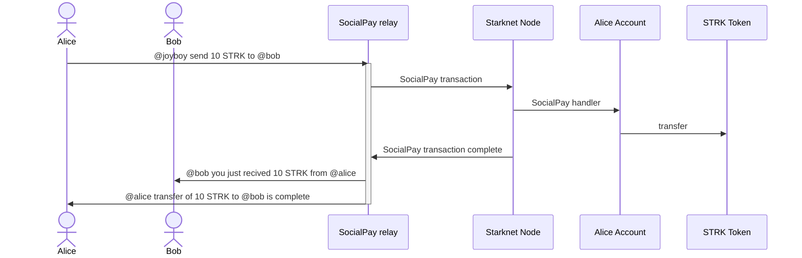

# Social pay repository with Relayer and tests

The Social pay provide Nostr user to send token easily via Starknet.

### Alice sends tokens to Bob




## Tasks

The script only  work in Sepolia at this stage. Working to fix the devnet script to test it on local.

Done: 
- [x] Create SocialAccount (Contract or A.A when SNIP-6 is fully implemented)
- [x] Utils for Nostr & Starknet to format, check, deploy and do call on Starknet
- [] Tiping: Start Mocha script 

WIP: 
- [] Format & Deserialize SocialPay Request to send to the contract
- [] Fix type of SocialPay request attributes
- [] Verify signature and call handle transfer balance
- [] Tiping: Mocha Flow end to end working with Starknet call

TODO: 
- [] Script working on Devnet (Contract not Found issue mainly, even with using running devnet with -- --seed 0)

## How install and use it: 

The script is working only on Sepolia.
Please setup your .env correctly as the exemple.
If you want to do it on Localnet, change the Provider in this file to use your RPC_ENDPOINT:

[Starknet utils](./utils//starknet.ts) 

### Locally

Create and Setup your .env file, use .env.exemple as exemple

Install the packages
```bash 
    npm i
```

Run the test by Default in Sepolia
```bash 
    npm test
```


#### Devnet script need to be fix.
Run the Social relay in WIP
```bash 
    npm run relay:dev # with nodemon
    npm run relay
```

Run a Starknet dev:
[Localdevnet](https://github.com/0xSpaceShard/starknet-devnet-rs?tab=readme-ov-file) 


```bash 
    cargo run 
```

### Docker 

Work in progress

## Test the integration

Tests are script in Typescript. We use Chalk and Mocha.

The script run in default with Sepolia.
If you want to do it on Localnet, run your devnet and change the Provider in this file to use your RPC_ENDPOINT:
[Starknet utils](./utils//starknet.ts) 


Run the integration test end to end
```bash 
    npm run test
```

Not needed to test the script, only if you want to send it on a Relayer.

Run the Social relay in WIP
```bash 
    npm run relay:dev # with nodemon
    npm run relay
```
