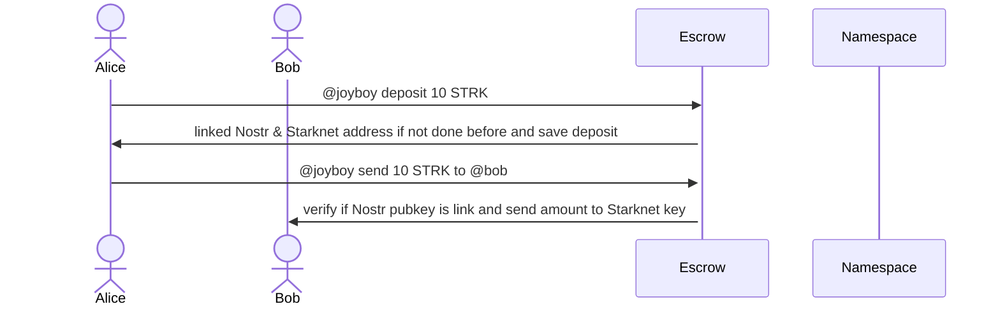

Escrow proposal DRAFT


# Vision

Escrow, compared to A.A customized, it can be more integrated into the Starknet ecosystem and other Wallets. 
I think it can help for more integration and UI/UX, with less keys to manage, features to do, and security concerns on the Joyboy client. 
In this case, the Client/Relayer/Wallet & Payment stack are dissociated.

Pros:

- user can deposit / withdraw assets easily from anywhere in the ecosystem (Argent, Bravoos, Joyboy).
- We don't need to manage our Starknet pubkey and be a well-garden. Moarrr integrations for Nostr x Starknet.
- Escrow possibilities and features by Joyboy and every builder: DAO, Channels, Batch transfer, Merch, SocialFi

Cons:

- Contracts & Security issues

# Implementation

On the contract side, we can have:
- Namespacing contracts:
Linked Nostr & Starknet address.

- Escrow: 
Deposit, withdraw, claim, send, and manage funds.

We have a few ways of implementing this with an Escrow.

- Joyboy Escrow: A single escrow for Joyboy.

- Custom Escrow deployed by one account: The user has to deploy his own contract, which can be more customized.

## Namespacing: 

Mapping between Nostr pubkey & Starknet pubkey.

We can start with one-to-one management, but we can think about a Nostr pubkey to manage the List of StarknetAddress (Argent, Bravoos, Joyboy, OKX) by one Nostr pk: made one by one at least to verify also the sender() address.

handle_link: Send a Nostr Event to verify signature and create a Linked Profile with Pubkey Nostr and Starknet wallet.

### Nostr Event:

It can just be verify and not send on the Nostr relayer for "privacy" issue if needed.

```json
{
  "kind": 1,
  "content": "nostr_pubkey linked starknet_pubkey",
  "tags": [
 ],
  "pubkey": "97c70a44366a6535c145b333f973ea86dfdc2d7a99da618c40c64705ad98e322",
  "created_at": 1679673265,
  "id": "30efed56a035b2549fcaeec0bf2c1595f9a9b3bb4b1a38abaf8ee9041c4b7d93",
  "sig": "f2cb581a84ed10e4dc84937bd98e27acac71ab057255f6aa8dfa561808c981fe8870f4a03c1e3666784d82a9c802d3704e174371aa13d63e2aeaf24ff5374d9d"
}
```

## Escrow:

I think about both, we can start with the first one (Joyboy core Escrow), but the second one have also few others advantages/weak.

### Joyboy escrow:

Interact with Namespace contract.

States: 
Write state for Deposit by Starknet user linked by a Nostr pk.


In this case, we need to manage properly different functions and states:

- deposit(): fund Starknet address related to a Nostr account.
- withdraw(): withdraw an amount related to a Starknet address related to a Nostr account.
- handle_transfer(): Same as already created, just verify the state of deposit of the corresponding user before transfer the ERC20/ERC721.
- handle_nostr_transfer(): Transfer function to used with a Nostr pubkey recipient and check if linked account are made. Can be claim if Nostr users are not already linked.
- claim(): can be used for an Claim escrow or if user doesn't have already linked their key.

Pros:
- Starting with a simple one Contract is better?  
Serve as an exemple and more easy to do.

Cons: 
- Fund are managed my one contract, security concerns.


### Custom owned escrow:

Can only be call by an owner and others management address (more A.A similar if if it's not).

State related to the owner, less management and more customizable for the Starknet & Nostr ecosystem.

Pros: 
- Less state and right management between each users of the Escrow.
- Can be a good start to create a building block to Starknet dev building features on top of it.

Cons:
- Relations between different Escrow contract can be difficult.


## Flow


This draft flow abstract the Client, Wallet, Relayer part.

Namespace & Escrow are different contracts that's need to interacts together, only using Escrow (that's use namespace call) on this Flow.

