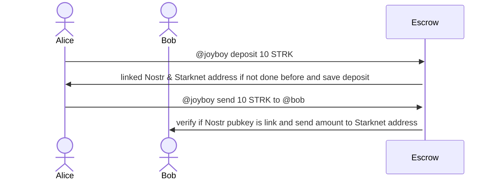

# Escrow proposal: Vision & Purposes

Escrow & Vault have few advantages compared to A.A customized by Joyboy with BIP-340:

This solution can be more integrated into the Starknet ecosystem and other Wallets (Argent, Bravoos, OKX, Joyboy after and others).
I think it can help for more integration and UI/UX, with less keys to manage, features to do, and security concerns on the Joyboy client.
In this case, the Client/Relayer/Wallet & Payment stack are dissociated.

Pros:

- User can deposit / withdraw assets easily from anywhere in the ecosystem (Argent, Bravoos, Joyboy).
- We don't need to manage our Starknet pubkey and be a well-garden. Moarrr integrations for Nostr x Starknet.
- Escrow possibilities and features by Joyboy and every builder: DAO, Channels, Batch transfer, Merch, Payment like Sablier, SocialFi

Cons:

- Contracts & Security issues

# Implementation

On the contract side, we can have:

- Namespacing contracts:
  Linked Nostr & Starknet address.

- Escrow:
  Deposit, withdraw, claim, send, and manage funds.

We have a few ways of implementing this with an Escrow.

- Joyboy Escrow: A single escrow for Joyboy.

- Custom Owned Escrow deployed with a Factory or deployed by an user: The user can deployed it's owned escrow customizable with a Factory, or has to deploy his own contract which can be more customized.

## Namespacing:

Mapping between Nostr pubkey & Starknet pubkey.

We can start with one-to-one management, but we can think about a Nostr pubkey to manage the List of StarknetAddress (Argent, Bravoos, Joyboy, OKX) by one Nostr pk: made one by one at least to verify also the sender() address.

handle_link: Send a Nostr Event to verify signature and create a Linked Profile with Pubkey Nostr and Starknet wallet.

```ts

// storage
interface {
  // Linked nostr key that's can Starknet Address list of Escrow owned
  nostr_users:Map<ByteArray || uint256, // nostr_pubkey
  List<StarknetAddress> // One account or Multi address possible
  >;
  delegated_nostr_key:Map<
  StarknetAddress, //
  List<ByteArray||uint256>
  >
}
```

### Nostr Event:

It can just be verify and not send on the Nostr relayer for "privacy" issue if needed.

```json
{
  "kind": 1,
  "content": "nostr_pubkey linked starknet_pubkey",
  "tags": [],
  "pubkey": "97c70a44366a6535c145b333f973ea86dfdc2d7a99da618c40c64705ad98e322",
  "created_at": 1679673265,
  "id": "30efed56a035b2549fcaeec0bf2c1595f9a9b3bb4b1a38abaf8ee9041c4b7d93",
  "sig": "f2cb581a84ed10e4dc84937bd98e27acac71ab057255f6aa8dfa561808c981fe8870f4a03c1e3666784d82a9c802d3704e174371aa13d63e2aeaf24ff5374d9d"
}
```

Above exemple with a content request is the easy way to do it.
We can think about a NIP after and use existing one, but more complicated.

## Escrow:

I think about both, we can start with the first one (Joyboy core Escrow), but the second one have also few others advantages/weak.

### Joyboy escrow:

We can have a lot of implementations solutions.

Escrow interact with Namespace contract deployed.

States:
Write state for Deposit by Starknet user linked by a Nostr pk.

Let's start with a very simple draft (without all details, security concerns etc)

Can be used as an exemple: 
[Tokei contract like Sablier](https://github.com/starknet-io/tokei/blob/main/src/core/lockup_linear.cairo)

```ts
interface ContractState {
  namespace_address: string;
  users_escrows: Map<
    string || ByteArray || StarknetAddress, // starknet address or nostr, we can have two distinct map depends if the users is already linked or not


    // We have two way, an escrow that"s manage every token, or one escrow by token
    // Let's start with one Escrow with state by token address
    UserFund
  >;
  claimable_amount:Map<string, // by nostr key
  EscrowGift[]>
}

interface UserFund {
  nostr_key: uint256; // BytesArray;
  starknet_key: StarknetAddress; //
  tokens:Map<
  StarknetAddress,
  TokenEscrow
  >
}
/** 
 * Token management detail by User
*/
interface TokenEscrow {
  deposited: uint256;
  transfered: uint256;
  withdrawn: uint256;
  // Not a direct transfer or just you are not linked before as needed,
  //  but payment request claimable with date or not. Like Sablier and Tokei for exemple, or a Gift to onboard user to Starknet by Nostr user or inversely.
  to_claimed: uint256;
  // If we accept users can use different Starknet address with one Nostr pubkey. Need to be linked one by one to verify contract_address as a sender.
  others_strk_key?: StarknetAddress[];
}

interface EscrowGift {
  sender:StarknetAddress;
  nostr_sender:uint256;
  asset:StarknetAddress;

  recipient: StarknetAddress; //
  recipient_nostr: uint256; //
  deposited: uint256;
  total_
  claimed: uint256;
  withdrawn: uint256;
  start_time:u64;
  end_time:u64;
  is_canceled:boolean;
}
```

Event are need to verify Nostr signature input params below.

We need to manage properly different functions and states (draft below):

1. User

- deposit(request: SocialPay::Deposit):
  Fund Starknet address related to a Nostr account.

- withdraw(request: SocialPay::Withdraw):
  withdraw an amount related to a Starknet address related to a Nostr account.

- handle_transfer(request: SocialPay::Transfer):
  Same as already created, just verify the state of deposit of the corresponding user before transfer the ERC20/ERC721.

- handle_nostr_transfer(request: SocialPay::TransferToNostrKey):
  Transfer function to used with a Nostr pubkey recipient and check if linked account are made. Can be claim if Nostr users are not already linked.

- claim(request: SocialPay::Claim):
  can be used for an Claim escrow or if user doesn't have already linked their key.
  Also can be like a Payment request, Gift, with date requirements or not.

A lot of cool features can be implemented in that's way I think.

2. Admin function

- set_namespace_address(address:StarknetAddress)

Pros:

- Starting with a simple one Contract is better?  
  Serve as an exemple and more easy to do.

Cons:

- Fund are managed my one contract, security concerns.

### Custom owned escrow:


Factory deployer of Owned escrow.
Create the base of the Escrow and Smart vault.
Can only be call by an owner and others management address.

State related to the owner, less management and more customizable for the Starknet & Nostr ecosystem.

Pros:

- Less state and right management between each users of the Escrow.
- Can be a good start to create a building block to Starknet dev building features on top of it.

Cons:

- Relations between different Escrow contract can be difficult.

## Flow

This draft flow abstract the Client, Wallet, Relayer part.

Namespace & Escrow are different contracts that's need to interacts together, only using Escrow (that's use namespace call) on this Flow.


